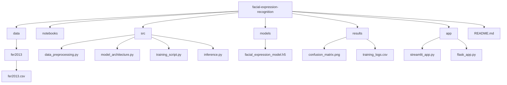

```mermaid
graph TD
    A[facial-expression-recognition] --> B[data]
    A --> C[notebooks]
    A --> D[src]
    A --> E[models]
    A --> F[results]
    A --> G[app]
    A --> H[README.md]

    B --> B1[fer2013]
    B1 --> B2[fer2013.csv]

    D --> D1[data_preprocessing.py]
    D --> D2[model_architecture.py]
    D --> D3[training_script.py]
    D --> D4[inference.py]

    E --> E1[facial_expression_model.h5]

    F --> F1[confusion_matrix.png]
    F --> F2[training_logs.csv]

    G --> G1[streamlit_app.py]
    G --> G2[flask_app.py]
```
